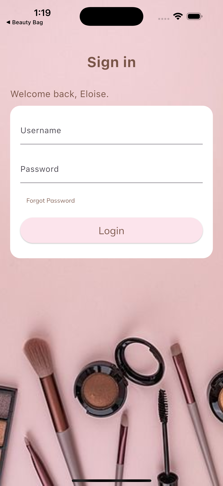
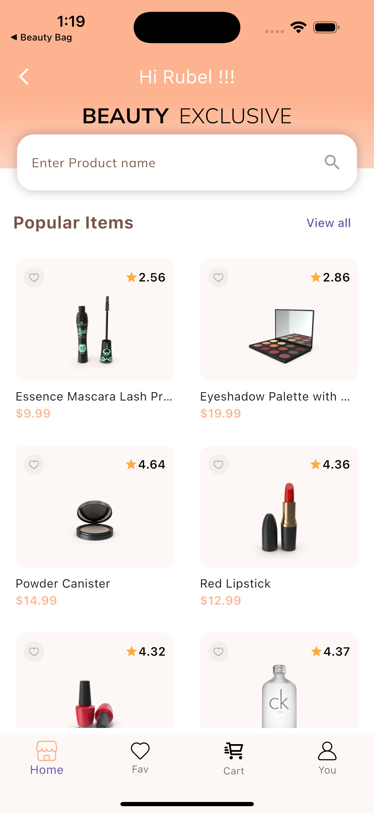
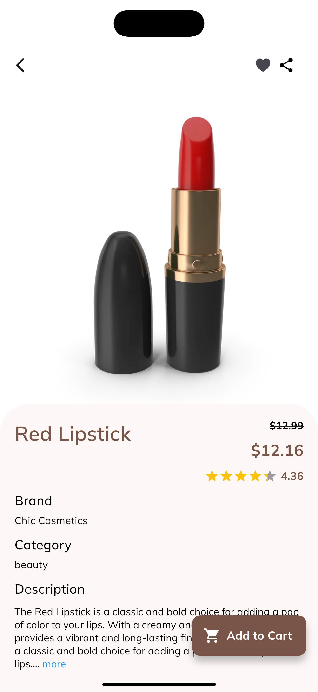
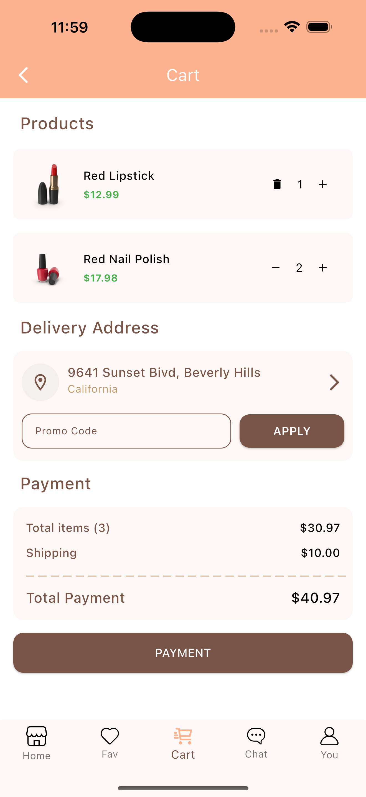

# beauty_bag

# Flutter Makeup App
A Flutter app that fetches and displays a list of Makeup Products from a public API.

## Features
- List of products
- AI chatbot Assistance
- Search functionality
- Detail screen
- Profile Screen
- Add and remove favourites Products
- Responsive and Beautiful UI

## Setup Instructions
1. Clone the repo:
   git clone https://github.com/Rubel786/Beauty_Bag.git
   cd BeautyBag

2. Install dependencies:
   flutter pub get

3. Run the app:
   flutter run

## Tech Stack
- Flutter SDK: [3.29.3]
- State Management: [Provider]
- HTTP Client: [http]
- Persistence: [shared_preferences]

## State Management Explanation

I have use "_MVVM_" architecture for this project. For state management I used "_Provider_" and "_setState_" both as per requirement in the app.
In main file used _MultiProvider_ for Favourites and Product card. Shared preferences for storing favourites even if we log out from the app.  We can logout from the app if back pressed on home screen.
It also had feature of Session time out using token from API after 30 minutes of using app.

## Credentials
- username: emilys
- password : emilyspass

## Known Issues / Limitations
Yes lot of things are needed to improve , like profile screen all features and Add to cart. That is my future goal for this app.

## 📱 Screenshots

### 🔐 Login Screen

### 🏠 Home Screen

###  Detail Screen

###  Cart Screen

###  AI Chat Screen

